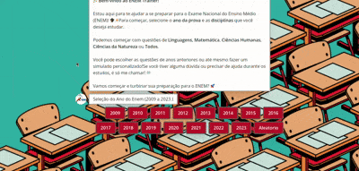

<h1 align="center">ENEM Trainer: Chatbot para Treino de Estudantes com Questões do ENEM
</h1>

## Sumário

* [Descrição](#descrição)
* [Requisitos](#requisitos)
* [Tecnologias](#tecnologias)
* [Fluxo do Software](#fluxo-do-software)
* [Dificuldades](#dificuldades)
* [Resultados](#resultados)
* [Conclusão](#conclusao)

## Descrição

O Chatbot ENEM Trainer é uma solução interativa desenvolvida para auxiliar estudantes na preparação para o Exame Nacional do Ensino Médio (ENEM). Integrando a [API ENEM](https://enem.dev/) de [**Yunger7**](https://github.com/yunger7), o chatbot oferece uma experiência personalizada, prática e eficiente de estudo.  

## Requisitos  

- [x] **Menu de Seleção do Ano do Exame:**  
  - Apresentar uma lista clara e organizada de anos disponíveis para o exame.  
  - Permitir que o usuário escolha o ano desejado com apenas um clique.  
  - Retornar ao menu principal caso o usuário queira mudar a seleção.  

- [x] **Menu de Seleção das Disciplinas:**  
  - Exibir as disciplinas de forma visualmente atraente e categorizada (Linguagens, Matemática, Ciências Humanas e Ciências da Natureza).  
  - Garantir que o usuário possa alternar facilmente entre as disciplinas, caso mude de ideia.  
  - Adicionar um botão de "Voltar" para retornar ao menu de seleção do ano.  

- [x] **Envio da Questão com Alternativas:**  
  - Apresentar a questão em formato claro, com destaque no enunciado.  
  - Listar as alternativas (A, B, C, D, E) de forma bem estruturada, garantindo acessibilidade e legibilidade.  
  - Incorporar suporte para imagens ou gráficos caso a questão os contenha.  
  - Feedback imediato após a seleção da resposta (certa ou errada) com uma explicação breve, quando aplicável.  

- [x] **Caixa de Opções no Final:**  
  - Adicionar botões claros e intuitivos:  
    - **Próxima Questão:** Carregar automaticamente a próxima questão do mesmo ano e disciplina selecionados.  
    - **Voltar ao Menu:** Retornar ao menu principal para escolher outro ano ou disciplina.  
  - Incluir feedback visual (como ícones ou animações) para indicar que a ação foi processada com sucesso.  

## Tecnologias  
- **[API ENEM](https://enem.dev/)**: Fonte principal de questões e informações sobre o exame.  
- **Typebot**: Plataforma para criação e execução do chatbot, garantindo uma interface amigável e acessível. 
- **JavaScript**: Linguagem para criação de funções mais complexas no chatbot.
- **Docker**: A estrutura do Typebot foi rodada em um docker proprio.

## Dificuldades

### Dificuldades Fictícias na Criação das Funções de Preferências do Usuário

- [x] **Estruturação e Armazenamento das Preferências do Usuário**  
  - Decidir onde e como armazenar as preferências do usuário.  
  - Garantir que as preferências sejam persistentes entre as sessões.  
  - Exemplo: Implementar um sistema de armazenamento local usando cookies ou sessões versus usar um banco de dados para salvar as escolhas do usuário.

- [x] **Implementação de Filtros Dinâmicos**  
  - Criar um mecanismo que filtre questões dinamicamente com base nas disciplinas e anos selecionados pelo usuário.  
  - Garantir que a combinação das preferências retorne apenas questões relevantes.  
  - Exemplo: Se o usuário selecionar "Matemática" e "2018", o sistema deve apresentar apenas essas questões, mesmo que os dados estejam armazenados em diferentes formatos.

- [x] **Gerenciamento de Dados Faltantes ou Incompletos**  
  - Algumas combinações de anos e disciplinas podem não ter questões disponíveis.  
  - Lidar com cenários em que a API retorna dados inconsistentes ou ausentes.  
  - Exemplo: O usuário escolhe "Física" e "2015", mas a API não possui questões para essa combinação.

- [x] **Sincronização entre API e Preferências do Usuário**  
  - Garantir que as preferências do usuário sejam corretamente interpretadas e usadas para consultar a API.  
  - Lidar com atrasos ou falhas na API que podem impactar a experiência do usuário.  
  - Exemplo: Se o usuário mudar de ano ou disciplina enquanto a API ainda está carregando os dados, pode ocorrer um erro ou inconsistência.

## Resultados

## Resultados

Chatbot funcionando

